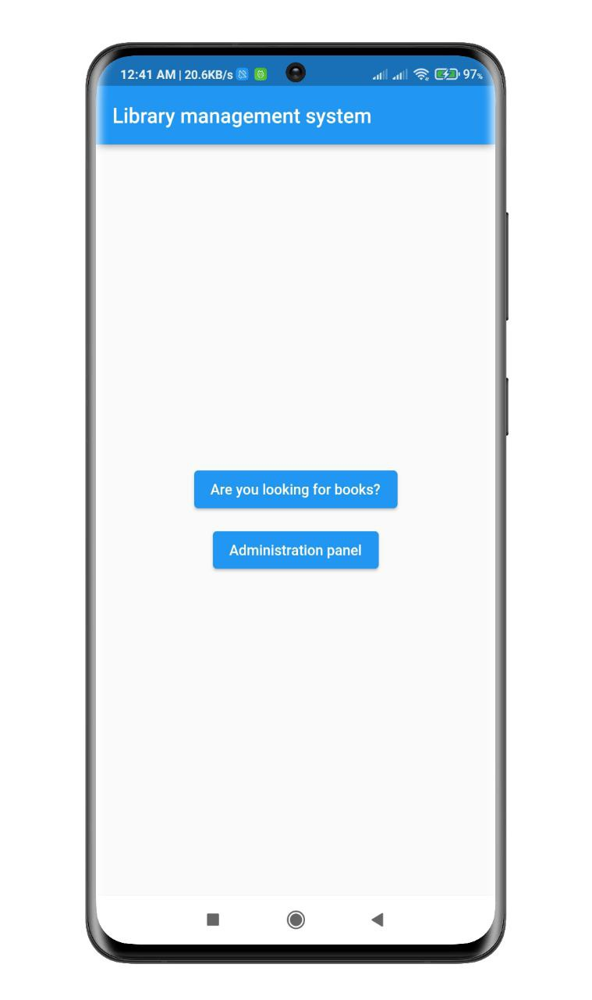
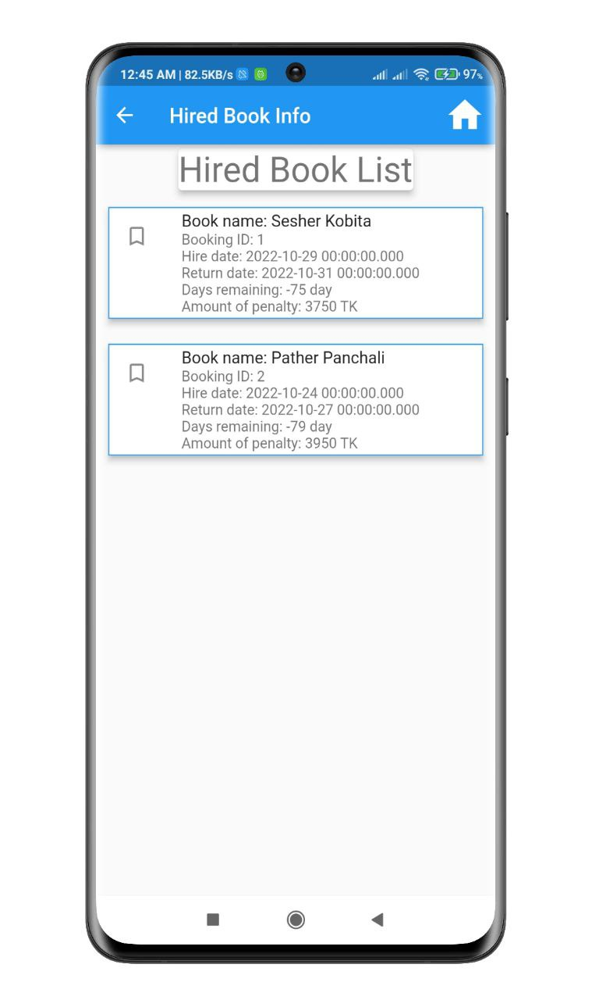
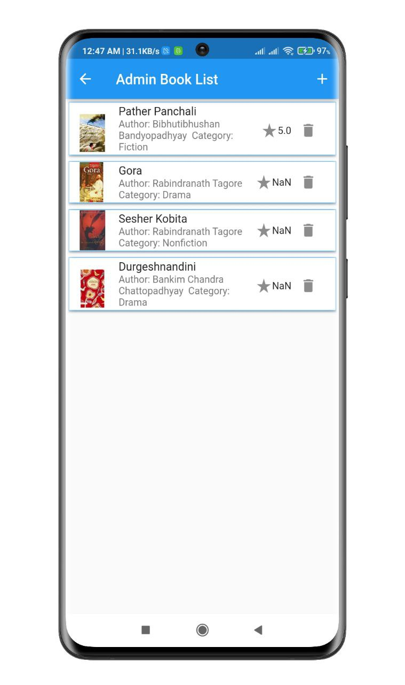
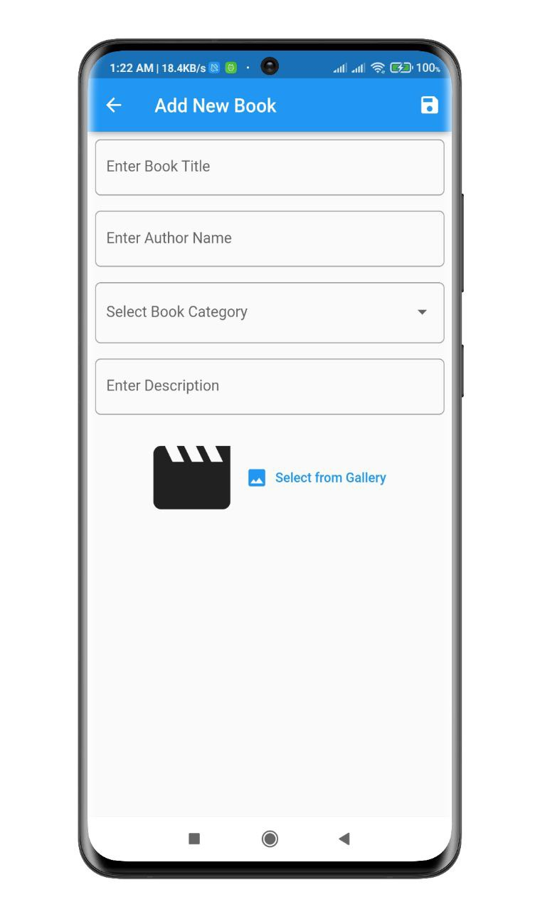

# Library Management System App

Users can borrow books and then return them in time. If the return time is over then the fine will be counted automatically. Sqflite CRUD operations performed.

## Screenshots

#### For User
<p align="center">
  
  
  
</p>
<p align="center">
  
  
  
</p>
<p align="center">
  
  
</p>

#### For Admin
<p align="center">
  
  
  
</p>
<p align="center">
  
  
  
</p>


## Features
#### *One app for User & Admin*
#### For User Panel
- User can login, register, logout
- Book filtering option
- Can see details of books 
- Rating and comments for users
- Book Hiring system
- Book can save and Check all hired & saved books list

#### For Admin Panel
- Admin can login, register using refferal code and logout
- Can check all requested book list for all users
- Admin can add book, delete book, and update book information
- Admin can reply users comments


## Setup

Clone the repository

```bash
  git clone https://github.com/muradhossin/library_management.git
```
Move to the desired folder

```bash
  cd \library_management
```
To run the app, simply write

```bash
  flutter pub get
```
```bash
  flutter run
```
## Tech Stack

**Built With:** Dart, Flutter

**State Management:** Provider

**backend:** Sqflite


## Platform

- Android


## Contributing

Contributions are always welcome!

See `contributing.md` for ways to get started.

Please adhere to this project's `code of conduct`.


## License

[MIT](https://choosealicense.com/licenses/mit/)


## Support

For support, please contact here [](https://linkedin.com/in/md-murad-hossin)

  💰 You can help me by Donating
  [](https://buymeacoffee.com/muradhossin) 
